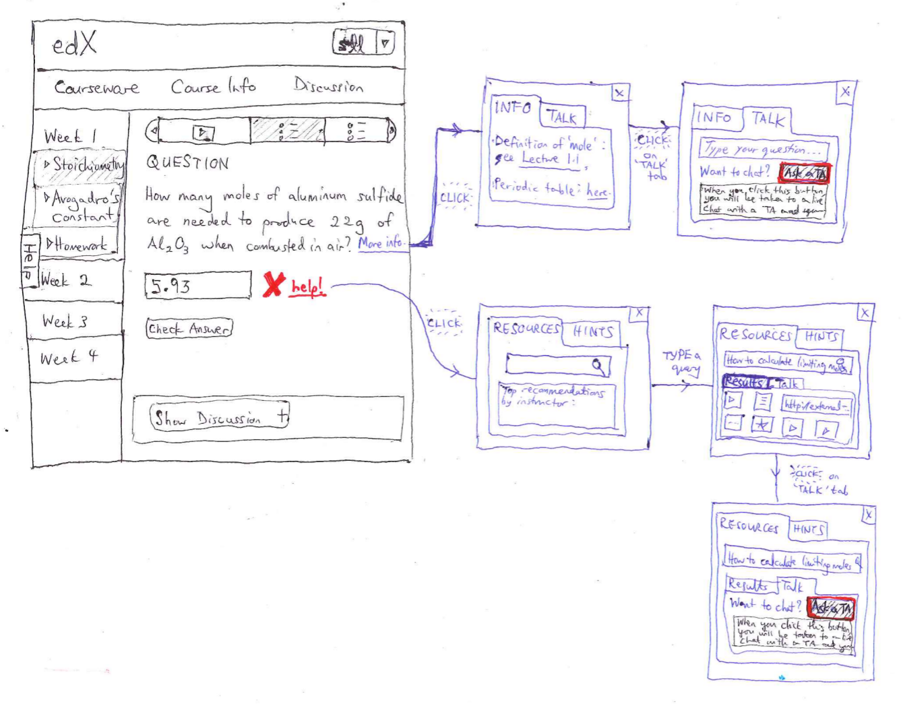

Learning Sciences Architecture Discussion
=========================================

This is a long-term roadmap: 

0.  It's not expected to stay the same. 
0.  It's not expected to be built at once. The goal is to define reasonable component boundaries. 

Recommender System for Learning Resources
-----------------------------------------

Social XBlocks
--------------

*  Chat XBlock (see design doc)
*  Google Hangouts XBlock
*  Shared Whiteboard XBlock
*  Discussion XBlock
In an ideal case, these would share a common interface. 

Player XBlocks
--------------
*  Show chat transcript
*  Play back hangout video
*  Play back whiteboard session

Student peering component
-------------------------
*  Social network proximity
*  Do I know concept X? 
*  Geographic proximity
*  Are they on-line at the same time? 
*  Do they tend to be on-line at the same time? 
*  Communication style
*  Cultural background
*  Linguistic background
*  Similar answer on question Y

This would live in Insights. In an ideal case, we would two sets of APIs building on top of each other: 
0.  Peering API (“Get me a peer for Bob”). People could plug in different peering components
0.  Metrics API (“How similar is Bob to Sue along the linguistic axis”). People could plug in different components, and the peering API would use above. 

Resource recommender system
---------------------------
Simple, pluggable API. “Bob needs help. What resource do I show him?”

This would live in Insights. Researchers could compete on best system.

It could have both manual (a TA/instructor assigns a resource to a
query) and automated components. We need to define what resources can
bring in with them in terms of metadata (e.g. tags, the original
question that generated the resource, etc.)

XBlocks extensions
------------------
*  XBlocks would need to have the ability to show a different, non-child XBlock. If a student hits “I need help,” and the system decides the best way to help is to show a video from a different course, there needs to be some way to show this in-line. 
*  XBlocks needs to be able to query Insights (or arbitrary services) through the runtime. 
*  XBlocks either need pub/sub events within a page, or some way to subscribe to information from the server (so that they can be pushed to show a hint). Prototype

Flipped classroom component
---------------------------
As in X2. 

Integration with edX platform
-----------------------------
See the Getting Help with edX doc. Proposed mock:

This UI connects to the following components:
*  resource recommender system
*  hints service
*  live chat/hangout/etc. service

