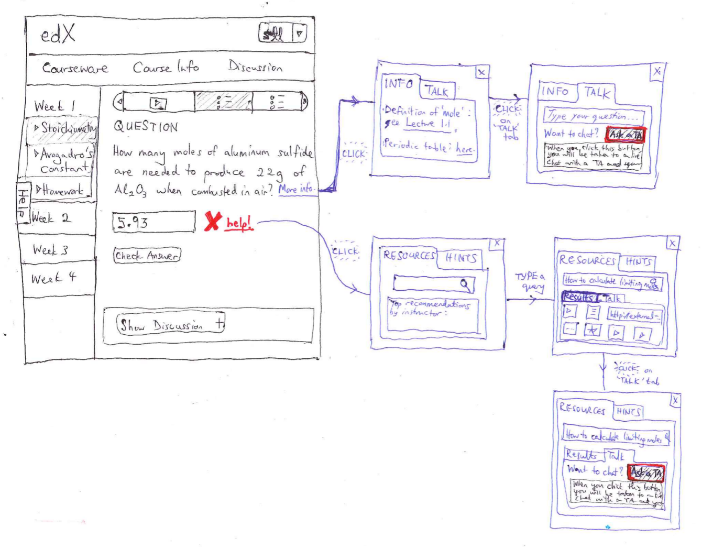
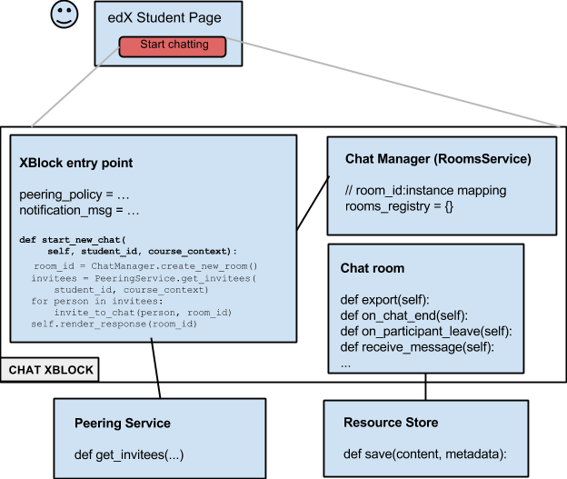
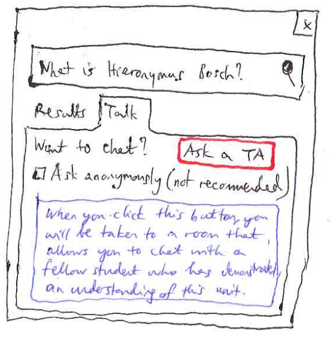
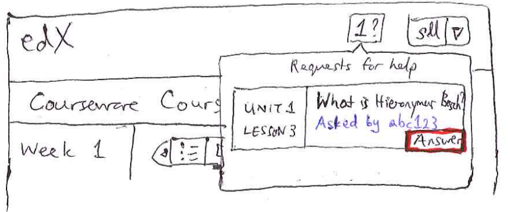
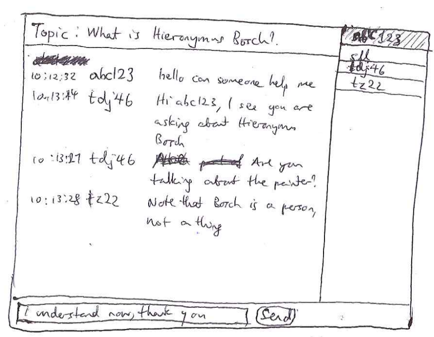
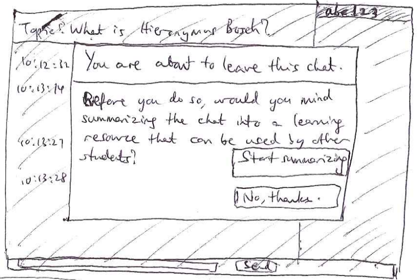

Design document for a live-chat XBlock
======================================

WORK IN PROGRESS
----------------

**Aim**: Build a standalone chat xblock that can be used in different
  contexts. A primary context is to provide help to students who get
  stuck on problems when taking an edX course.

Primary use case
----------------

*Note: We plan to build the XBlock as a standalone component that can
be used elsewhere, and the following use case is not
exclusive. However, it does provide a concrete example of the kind of
problem that this XBlock can address.*

Alex gets stuck and frustrated while solving a problem in an edX
course, and asks for help. This brings up a modal dialog which allows
the student to view related resources or hints. If neither of these is
sufficient, the student also has the opportunity to start a chat with
other course helpers by typing a question and clicking a “Ask a
helper” button (these are the red buttons in the diagram below).  

When the “Ask a helper” button is clicked, some other students who are
online at the same time will receive a notification with Alex’s
question. If they click this notification, they will join Alex (and
other helpers who clicked the notification) in a transient chat room.

At the end of the conversation, participants are given the option of
transforming their chat log into a learning resource that can be
discovered by other students with a similar question. Otherwise, the
chat log may be stored so that someone else (e.g. an instructor, TA or
fellow student) can transform it into a useful learning resource for
others.

For a deeper dive into other aspects of this use case from an
instructional design perspective, please see the Getting Help in edX
document.

Product mocks
-------------

Entry point ('lobby')

Notification UI

Chat room

Dialog box shown to participants when they leave the chat room. This
invites them to make their conversation into a learning resource.

Questions and answers
---------------------

**Q:**	How does a student sign up to become a helper?

**A:** 	The minimum requirement for becoming a helper is determined by the course creator. E.g., a student may become eligible to help with a particular unit when they have met minimum scoring criteria on the homework for that unit. Such students will receive an invitation, at the time they first become eligible, to be a 'student helper'. The student may accept or decline the invitation.
At any time, a student helper can go to his/her profile page and customize which units he/she is willing to help with. He/she can do this by selecting units from the set of units for which he/she is eligible to help.
Note that the implementation of this functionality is not part of the chat xblock. It will probably be part of the peering service (or its inputs).

**Q:**	When a helper receives a notification, when does it expire?

**A:**	Notifications do not expire until everyone leaves the chat room. TBD: when a helper clicks on the notification, is he/she routed to the particular student who caused the notification to be sent, or is he/she routed to some student who needs help at the time? Probably the former because the helper sees the question that was asked and would be surprised to be faced with a different question instead.

**Q:**	What happens if no one 'picks up the call'?

**A:**	If no one picks up within some reasonable time (a few minutes), we send the same request to a larger pool of other eligible helpers. We continue doing this in intervals while always displaying a status message to the initiator of the call.

**Q:**	How do you determine which students to send a notification to?

**A:**	For v1 we will probably use a simple load balancing implementation: pick a number of students at random from the ones that have answered the fewest calls. This is not optimal for a number of reasons (e.g. 'few calls picked up' may indicate a lack of time, but it might also indicate a lack of active interest in helping). To do this properly we will need some sort of dedicated peering system but this will only happen in v2 or later.

Technical requirements
----------------------

*  The xblock should be embeddable in a webpage, using e.g. John's GAE player and <xblock id=”...”></xblock>. Some additional server setup may be required and this needs to be documented fully.
When the xblock is embedded in a webpage, it presents itself as a button. In v1 it will not be possible for non-technical users to customize this UI (or, customization might be limited to a small number of Boolean options).
*  When this button is clicked, a new browser window is opened for the recipient. This is called a 'room'.
*  The xblock will need to ping an external peering service (possibly multiple times) to figure out who to invite to a conversation.
*  It should be possible to initialize a room with a set of people who are allowed to be in it, and add new 'allowed invitees' to the room at any time.
*  The server should be able to send notifications (with links to the room) to selected invitees.
*  At any point during the conversation, any user can export the unedited chat log in a form that can be used by other systems (e.g. a persistent database, an editor that allows students to convert the chat transcript to a learning resource, or a personal copy for the student to save).

External dependencies and interfaces
------------------------------------

0.  Need to specify format in which to export interaction artifacts
0.  Need to specify service boundaries and interfaces (interface to entry point incl. student state, room management service, the actual chat server which the xblock orchestrates interactions on top of, customization interface by course creator, a peering service, a resource store for artifacts).

We should try to make these interfaces extensible to other types of social xblocks (e.g. hangout, whiteboard, etc.).

Preliminary work plan
---------------------

1. [done] Get chat server/client up and running.
2. Get simple xblock with entry point that is a button. When this button is clicked, it opens a new chat window whose room is hosted by the person clicking on that button. Delete the room from the server once it is empty.
3. Get the xblock in (2) to broadcast to other people in a fixed list (representing all TAs, say) and have these people join the chat with the student.
4. When the chat window is closed, export the chat log (cf. ejabberd's mod_log_chat module).

Design and implementation
-------------------------

=== Various chat implementation alternatives

*  http://candy-chat.github.io/candy/ with Jabber backend:  https://github.com/candy-chat/candy/wiki/Installing-a-Jabber-server
*  http://partychapp.appspot.com/
*  https://code.google.com/p/google-app-engine-samples/source/browse/trunk/multi-chat
*  MITx: Greasemonkey extension that showed an IRC channel (for mitx.mit.edu) embedded on the right side of the window: http://userscripts.org/scripts/show/128936.

Comparison of chat servers (2006): http://www.saint-andre.com/jabber/jsc/

Start with ejabberd; the above page and others suggest it is mature and fairly easy to install. Note that it is written in erlang.

*  Follow instructions on http://www.ejabberd.im/tuto-install-ejabberd
*  basically: apt-get install libncurses5-dev openssl libssl-dev erlang ejabberd apache2

To run chat server

*  Type 'sudo service ejabberd start'. Ignore the “Permission denied (ignored)” messages.
*  Connect on port 5280 (also 5222, 5269 give XML). It works!

To run Apache server so that we can get the candy demo

*  sudo service apache2 start
*  sudo service apache2 restart
*  May need to edit /etc/apache2/*.conf. Add to httpd.conf:
0.  LoadModule proxy_module /usr/lib/apache2/modules/mod_proxy.so
0.  LoadModule proxy_http_module /usr/lib/apache2/modules/mod_proxy_http.so
*  Enable rewrite directive: sudo a2enmod rewrite
*  For stuff in sites-enabled/, change AllowOverride None to AllowOverride All
*  To see logs: tail -f  /var/log/apache2/* where * is error.log or access.log

Install candy:

*  Instructions: http://candy-chat.github.io/candy/
*  Note that “web directory” means /var/www
*  To add a user: sudo ejabberdctl register user server password  (currently 1@localhost, 1)
*  Need to edit candy/example/index.html to add autojoin field and to do auto login.

Setting up; failovers; load balancing; security; monitoring
http://stackoverflow.com/questions/4132342/how-to-load-balance-users-over-an-ejabberd-cluster

